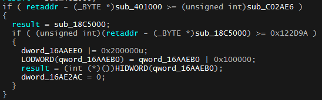

## ReturnCheck

There are many other ReturnChecks around for ROBLOX, like [Eternal's ReturnCheck Bypass](https://eternalv3.github.io/Retcheck/), and [Variable's ReturnCheck Bypass](https://v3rmillion.net/showthread.php?tid=148727), This isn't an 'expert' way of Bypassing this Check. It'll be great if you credit me.

______________________________________________

### About-ReturnCheck                                  
 ReturnCheck, also commonly known as 'Retcheck' is a Check added to 'improve ROBLOX's Security' (Totally not working well with that 'SECURITY'). As some of you might know, ROBLOX uses an 'edited' version of Lua5.1. They have installed this 'Check' in ***many***(almost all) of the LuaC API Functions (lua_getfield, lua_pcall, etc.). And being that stupid guy you are you want to bypass this Check without causing a massive pain in the but, triggering the unstoppable beast called the 'Integrity Checker'
 
 ____________________________________________
 
### About-IntegrityChecker                                                     
 This check is also like 'Retcheck', there is a more-common name for this Check, and it is 'The BIG HULK' (jks). No, it's called the Memory Checker. This checker is probably the most hardest to bypass. It scans for certain parts, maybe all to check if there had been any 'Memory Modifications' hence the name Memory Check.
 
____________________________________________

### Getting-Started

As I had said before, the Return Check is basically in every Lua C API (not all) function. This is a picture of 'The FULL Check'.


In out code, we need to bypass it and the return it back to the original Function, so that it would not trigger the Memory Check. We will store the Functions in DWORDS.

```cpp
DWORD sFlag1, sFlag2, sRetFunc, OldProtect;
```
Time to start the bypassing. First we need to store the Flags like this:

```cpp
	sFlag1 = *(DWORD*)Flag1;
	sRetFunc = *(DWORD*)Retfunc;
	sFlag2 = *(DWORD*)Flag2;
 ````
 Once this is done, we need to starting 'Bypassing' this, so we need to Change the protection to PAGE_EXECUTION_READWRITE to edit it
 ```cpp
 VirtualProtect((void*)Retfunc, 1, PAGE_EXECUTE_READWRITE, &OldProtect);
 ```
 And now, we need to Return the function, we will do it like this:
 ```cpp
 memcpy((void*)Retfunc, "\xC2", 1); // RETN OP Codes
 ```
 
 Now that we have finishing bypassing the Function, we now need to restore the function back to the original Function. We will make the Flags return to the RetFunctions:
 
 ```cpp
 	*(DWORD*)Flag1 = sFlag1;
	*(DWORD*)Retfunc = sRetFunc;
	*(DWORD*)Flag2 = sFlag2;
 VirtualProtect((void*)Retfunc, 1, OldProtect, &OldProtect);
 ```
 
 So Overall, we would Bypass Retcheck like this :
 ```cpp
 inline void Bypass() {
	sFlag1 = *(DWORD*)Flag1;
	sRetFunc = *(DWORD*)Retfunc;
	sFlag2 = *(DWORD*)Flag2;
	VirtualProtect((void*)Retfunc, 1, PAGE_EXECUTE_READWRITE, &OldProtect);
	memcpy((void*)Retfunc, wbyte, 1);
}
```
Before restoring it back to the original Function like this:
```cpp
inline void Restore() {
	*(DWORD*)Flag1 = sFlag1;
	*(DWORD*)Retfunc = sRetFunc;
	*(DWORD*)Flag2 = sFlag2;
	VirtualProtect((void*)Retfunc, 1, OldProtect, &OldProtect);
}
```

So To bypass 'Retcheck', we would 
```cpp
Bypass(); // Bypass it
// Function
Restore(); // Restore it
```

### The-END


EDIT: I have made this Retcheck for a while, and it is now basically like 'MemehaxV2's' Retcheck which I have no idea of, this is my second github account btw. Anyway Cya!
